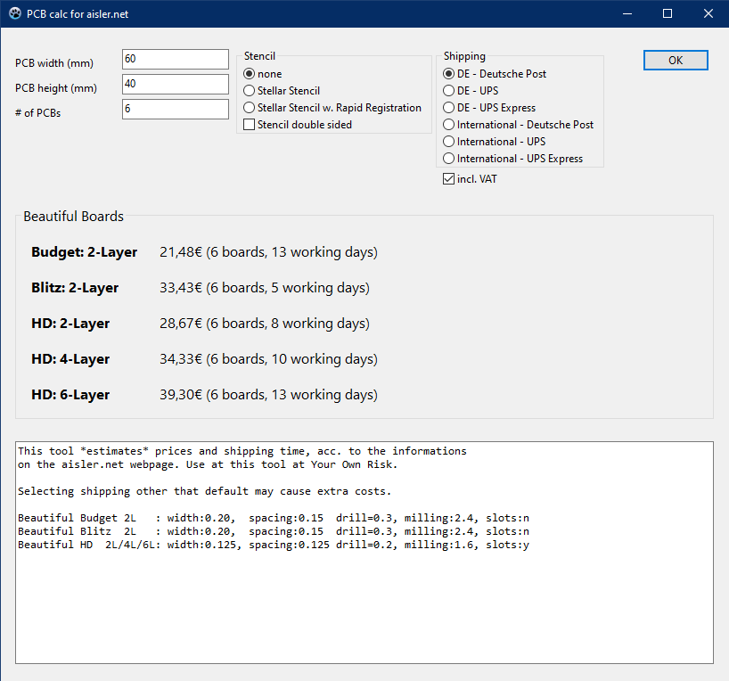

# aisl_PCB_costs
A tiny calculator for PCBs to be produced at aisler.net.

**This tool is my private tool and just shared with others. It may or may not calculate as expected and is intended to give an rough overview of ordering or design possibilities.**

***Use this tool at Your Own Risk.***

If you find more precise estimations, based on formulas and it's references, you may create an issue.

--wirbel
